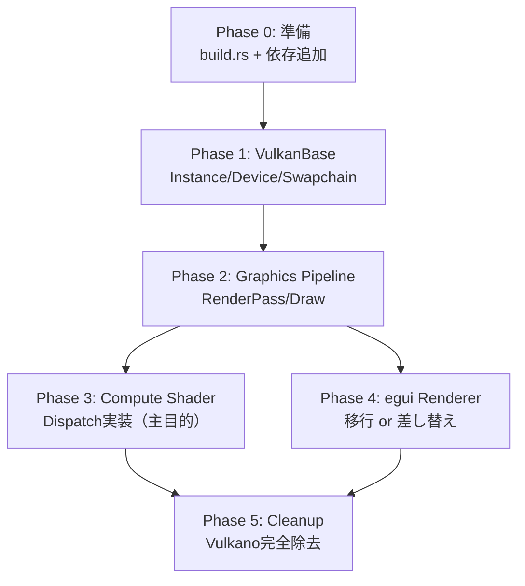

# Vulkano から ash への段階的移行計画 (v0.2)

## 現状分析

### Vulkan依存ファイル（書き換え対象: 5ファイル）

- [pipeline.rs](../src/pipeline.rs) (996行) -- 最も複雑。3つのGraphicsPipeline + 1 ComputePipeline、レンダーパス、コマンドバッファ記録
- [renderer.rs](../src/renderer.rs) (795行) -- egui専用レンダラ。独自GraphicsPipeline、テクスチャ管理、ディスクリプタセット
- [main.rs](../src/main.rs) (573行) -- `vulkano_util`(VulkanoContext/VulkanoWindows)でデバイス・スワップチェーン管理
- [integration.rs](../src/integration.rs) (164行) -- Gui wrapper（egui-winit + Renderer の薄いラッパ）
- [utils.rs](../src/utils.rs) (35行) -- Allocators（Memory/DescriptorSet/CommandBuffer）

### Vulkan非依存ファイル（変更不要: 10ファイル）
`simulation.rs`, `tree.rs`, `graph3d.rs`, `math/*`, `camera.rs`, `initial_condition.rs`, `ui.rs`, `ui_state.rs`, `settings.rs`, `ui_styles.rs`

### 移行の主な動機
- `tree_compute.comp` の compute dispatch が Vulkano では未実装（CPU フォールバック中）
- ash ではディスクリプタセット・コマンドバッファを直接制御でき、compute shader の実装が明確

---

## 新たに導入するクレート

- **`ash`** + **`ash-window`** -- Vulkan API バインディング + ウィンドウサーフェス
- **`gpu-allocator`** -- VMA相当のメモリアロケータ（`vulkano::memory` の代替）
- **`shaderc`** または **ビルドスクリプトで `glslc`** -- GLSL→SPIR-V コンパイル（`vulkano_shaders::shader!` の代替）

---

## フェーズ 0: 準備（ブランチ・ビルドスクリプト）

- `v0.2-ash` ブランチを作成
- `Cargo.toml` に `ash`, `ash-window`, `gpu-allocator`, `raw-window-handle` を追加
- シェーダーのビルドスクリプト (`build.rs`) を作成し、`src/shaders/*.{vert,frag,comp}` を `glslc` で SPIR-V にコンパイル → `OUT_DIR` に出力
  - `vulkano_shaders::shader!` マクロからの脱却
  - `include_bytes!` で実行時にロード
- この段階ではまだ Vulkano クレートも残しておく（並行ビルド可能にする）

## フェーズ 1: Vulkan基盤モジュール新設

**新規ファイル: `src/vulkan_base.rs`**

`vulkano_util` が隠蔽していた以下を ash で明示的に実装:

- `Entry` / `Instance` 作成（バリデーションレイヤ含む）
- 物理デバイス選択 / 論理デバイス・キュー作成
- `ash-window` でサーフェス作成
- スワップチェーン作成・リサイズ（`vk::KHR_SWAPCHAIN`）
- `gpu-allocator::vulkan::Allocator` の初期化
- コマンドプール作成

**構造体イメージ:**

```rust
pub struct VulkanBase {
    pub entry: ash::Entry,
    pub instance: ash::Instance,
    pub surface_loader: ash::khr::surface::Instance,
    pub swapchain_loader: ash::khr::swapchain::Device,
    pub device: ash::Device,
    pub physical_device: vk::PhysicalDevice,
    pub graphics_queue: vk::Queue,
    pub queue_family_index: u32,
    pub allocator: gpu_allocator::vulkan::Allocator,
    pub command_pool: vk::CommandPool,
    // swapchain state...
}
```

**変更先: `main.rs`**

- `VulkanoContext` / `VulkanoWindows` → `VulkanBase` に差し替え
- `acquire` / `present` のフレームループを `vkAcquireNextImageKHR` / `vkQueuePresentKHR` + セマフォ/フェンスで明示実装

## フェーズ 2: グラフィックスパイプライン移行

**対象: `pipeline.rs` の書き換え**

以下を ash API で再実装:

- レンダーパス（2サブパス構成を維持）
  - `vkCreateRenderPass` で attachment / subpass / dependency を手動記述
- フレームバッファ作成
- 3つのグラフィックスパイプライン（axes / particles / tree）
  - `vkCreateGraphicsPipelines` + `PipelineLayout` + push constants
  - SPIR-V モジュールは `build.rs` が出力した `.spv` を `include_bytes!` でロード → `vkCreateShaderModule`
- 頂点バッファ作成
  - `gpu-allocator` で `HOST_VISIBLE | HOST_COHERENT` メモリにアロケート
  - `set_particles` / `set_tree_vertices` / `set_graph_lines` のバッファ更新ロジックを維持
- コマンドバッファ記録
  - セカンダリCB（`VK_COMMAND_BUFFER_USAGE_RENDER_PASS_CONTINUE_BIT`）を維持
  - `vkCmdDraw`, `vkCmdBindPipeline`, `vkCmdPushConstants` 等
- 同期
  - `GpuFuture` チェーン → セマフォ+フェンスの明示管理に変更
  - フレーム in-flight 管理（2フレーム分のフェンス/セマフォ）

## フェーズ 3: Compute Shader 実装（主目的）

**対象: `pipeline.rs` の `compute_tree_vertices` を完全実装**

- ディスクリプタセットレイアウト作成
  - binding 0: Uniform Buffer (`GpuTreeComputeParams`)
  - binding 1-3: Storage Buffer（positions, normals, colors）
  - binding 4: Storage Buffer（atomic counter）
- ディスクリプタプール・セット割り当て
- `vkCmdBindDescriptorSets` + `vkCmdDispatch`
- GPU→CPU のバッファ読み戻し（`vkMapMemory` またはステージングバッファ経由）
- `tree_compute.comp` のバインディングと Rust 側バッファ構造の整合性を修正
  - 現状の不一致（1本のTreeVertexバッファ vs シェーダーの分離バインディング）を解消

## フェーズ 4: egui レンダラ移行

**対象: `renderer.rs` + `integration.rs`**

選択肢:

- **Option A（推奨）: `egui-ash-renderer` クレートを使用**
  - 既存の `Renderer` を削除し、`egui-ash-renderer` に委譲
  - テクスチャ管理・頂点バッファ・パイプラインが自動化される
  - サブパス 1 への統合は要検証

- **Option B: 自前で ash 版 Renderer を書き直す**
  - 現在の `renderer.rs` のロジックを ash API に1:1翻訳
  - egui のインライン GLSL シェーダーも `build.rs` 経由でコンパイル
  - より制御が効くが工数大

`integration.rs` (Gui wrapper) は薄いので、どちらの選択肢でも容易に対応可能。

## フェーズ 5: クリーンアップ・完成

- `Cargo.toml` から `vulkano`, `vulkano-shaders`, `vulkano-util` を削除
- `utils.rs` の `Allocators` 構造体を `VulkanBase` に統合して削除
- Drop / リソース破棄順序の検証（ash では手動で `vkDestroy*` が必要）
- バリデーションレイヤのエラーが出ないことを確認
- README に v0.2 の変更点を記載

---

## リスクと注意点

- **工数**: pipeline.rs (996行) + renderer.rs (795行) の書き換えが最大。ash は boilerplate が多いため行数は増加する見込み
- **Drop 安全性**: Vulkano は RAII で自動破棄されるが、ash では手動管理。`ManuallyDrop` や独自の `Drop` 実装が必要
- **egui 統合**: `egui-ash-renderer` のサブパス対応状況を事前に確認すべき。対応不十分なら Option B を選択
- **winit 互換**: `ash-window` が winit 0.30 に対応しているか確認が必要（現在 winit 0.30.12 使用中）
- **テスト**: `pipeline.rs` 末尾のテスト (`#[cfg(test)]`) も ash ベースに書き直す必要あり

## 推奨する作業順序の理由



Phase 1→2 は描画が動く最小単位。Phase 3 が本来の移行目的（compute shader）であり、Phase 2 の基盤があれば独立して進められる。Phase 4 は Phase 2 と並行可能だが、サブパス連携があるため Phase 2 完了後が安全。

---

## 実装メモ（移行中に発見した知見）

### 依存バージョンの選定

| クレート | バージョン | 備考 |
|---|---|---|
| `ash` | 0.38 | `loaded` feature 使用 |
| `ash-window` | 0.13 | raw-window-handle 0.6 対応 |
| `gpu-allocator` | 0.27 | egui-ash-renderer 0.8 との互換性のため (0.28ではなく) |
| `egui-ash-renderer` | 0.8 | gpu-allocator feature は無効化 |

### Drop 順序の注意

Rust は構造体のフィールドを宣言順にドロップする。Vulkan リソースの依存関係を考慮し、`App` 構造体のフィールド順を以下のように設定:

```rust
pub struct App {
    gui: Option<Gui>,                // 1番目にドロップ
    render_pipeline: Option<...>,    // 2番目にドロップ
    vulkan_base: Option<VulkanBase>, // 3番目にドロップ（allocator, device等を所有）
    window: Option<Arc<Window>>,     // 4番目にドロップ
    // ...
}
```

### ダングリングポインタの回避

`ParticleRenderPipeline` と `VulkanBase` 間で `Allocator` を共有する際、raw pointer ではムーブ後にダングリングになる。`Arc<Mutex<Allocator>>` を使用して安全に共有する。

### egui-ash-renderer の統合パターン

レンダーパスのコマンドバッファ記録順序:
1. `set_textures` (レンダーパス外で呼ぶ)
2. レンダーパス開始
3. 自前描画 (axes, particles, tree)
4. `cmd_draw` (egui描画、レンダーパス内)
5. レンダーパス終了
6. `free_textures` (レンダーパス外で呼ぶ)
